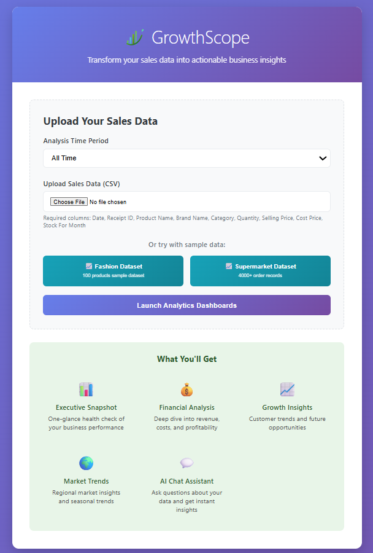
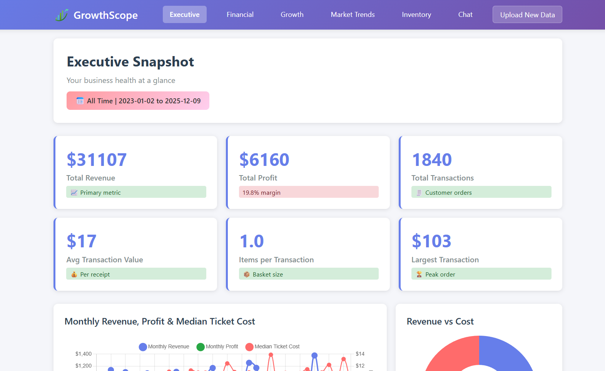
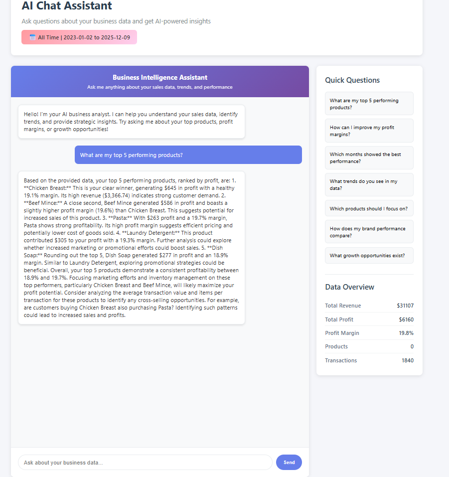

# 🚀 GrowthScope

**Transform your sales data into actionable business strategies**

A comprehensive business intelligence platform designed specifically for Australian Micro, Small & Medium Enterprises (MSMEs), combining powerful analytics with AI-driven insights to help businesses make data-driven decisions.

   

## 🏆 Hackathon Project

**Problem Statement**: *"What practical, SaaS-ready tools for Australian MSMEs can you build using low-code, no-code and generative AI?"*

**Solution**: GrowthScope - A business intelligence platform that transforms raw sales data into actionable insights using AI, specifically designed for the unique needs of Australian small businesses.

## 🌐 Live Demo

**Try GrowthScope now**: [https://growthscope.onrender.com](https://growthscope.onrender.com)

- **No installation required** - Access directly from your browser
- **Demo credentials** - Use any username/password to login
- **Sample data included** - Try the Fashion or Supermarket datasets
- **Full functionality** - All features available including AI chat assistant

*Note: First load may take 30-60 seconds as the server starts up*

## 🎨 Screenshots

### Home Page


*Home page of GrowthScope Application*

### Executive Dashboard


*Real-time KPIs and business health monitoring*

### AI Chat Assistant


*Natural language business intelligence queries*

## ✨ Key Features

### 📊 **Multi-Dashboard Analytics**
- **Executive Snapshot**: High-level KPIs and business health at a glance
- **Financial Deep-Dive**: Revenue, costs, profitability analysis with trend charts
- **Growth Intelligence**: Customer insights and expansion opportunities
- **Market Trends**: Regional market data and seasonal insights for Australian businesses
- **Inventory Management**: Stock optimization and reorder recommendations

### 🤖 **AI-Powered Chat Assistant**
- Ask natural language questions about your business data
- Get instant insights powered by Google Gemini AI
- Contextual responses based on your specific business metrics
- Strategic recommendations and actionable advice

### 📈 **Smart Analytics Engine**
- Automated profit margin analysis and product performance ranking
- Monthly trend analysis with predictive insights
- Brand and category performance comparison
- Transaction-level analytics for customer behavior insights
- Inventory optimization with restock date predictions

### 🇦🇺 **Australia-Focused Features**
- Regional market data for major Australian cities
- Currency formatting in AUD
- Market trends specific to Australian retail landscape
- Designed for Australian business compliance and reporting needs

## 🛠️ Technology Stack

### **Backend**
- **Python 3.12** - Core application logic
- **Flask** - Lightweight web framework
- **Pandas & NumPy** - Data processing and analytics
- **Google Gemini AI** - Natural language processing and insights

### **Frontend**
- **HTML5/CSS3** - Modern responsive design
- **JavaScript** - Interactive dashboards
- **Chart.js** - Beautiful data visualizations
- **Mobile-responsive** - Works on all devices

### **Data Processing**
- **CSV file support** - Easy data import
- **Real-time analysis** - Instant insights upon upload
- **Date range filtering** - Flexible time period analysis
- **Multi-format support** - Various CSV structures supported

## 🚀 Quick Start

### Prerequisites
- Python 3.12 or higher
- Google Gemini API key (optional for AI features)

### Installation

1. **Clone the repository**
   ```bash
   git clone https://github.com/yourusername/growthscope.git
   cd growthscope
   ```

2. **Create virtual environment**
   ```bash
   python -m venv venv
   source venv/bin/activate  # On Windows: venv\Scripts\activate
   ```

3. **Install dependencies**
   ```bash
   pip install -r requirements.txt
   ```

4. **Set up environment variables** (optional)
   ```bash
   export GEMINI_API_KEY="your_gemini_api_key_here"
   ```

5. **Run the application**
   ```bash
   python main.py
   ```

6. **Access the platform**
   - Open your browser to `http://localhost:5001`
   - Login with any username/password (demo mode)
   - Upload your sales data or try the demo datasets

## 📋 Data Format Requirements

GrowthScope supports CSV files with the following structure:

### **Standard Format**
```csv
Date,Receipt_ID,Product_Name,Brand_Name,Category,Quantity,Selling_Price,Cost_Price,Stock_For_Month
2024-01-15,RCP001,Wireless Headphones,TechBrand,Electronics,2,149.99,89.99,45
```

### **Required Columns**
- `Date` - Transaction date (YYYY-MM-DD format)
- `Receipt_ID` - Unique transaction identifier
- `Product_Name` - Product name
- `Brand_Name` - Brand name
- `Category` - Product category
- `Quantity` - Number of items sold
- `Selling_Price` - Price per unit sold
- `Cost_Price` - Cost per unit
- `Stock_For_Month` - Current stock level (optional, for inventory analysis)

## 🎯 Use Cases for Australian MSMEs

### **Retail Businesses**
- Track product performance across different brands
- Optimize inventory levels for seasonal demand
- Identify top-performing product categories
- Monitor profit margins and pricing strategies

### **E-commerce Stores**
- Analyze customer purchasing patterns
- Optimize product mix for maximum profitability
- Track monthly growth trends
- Identify opportunities for cross-selling

### **Service Businesses**
- Monitor service package performance
- Track customer retention and repeat business
- Analyze seasonal service demand patterns
- Optimize pricing strategies

### **Food & Beverage**
- Track menu item popularity and profitability
- Manage inventory for perishable goods
- Analyze seasonal demand patterns
- Optimize supplier relationships

## 🔧 Features Deep Dive

### **Executive Dashboard**
- Real-time KPI monitoring
- Profit margin health checks
- Top product performance
- Monthly revenue trends with forecasting

### **Financial Analysis**
- Detailed P&L breakdown
- Cost analysis and optimization opportunities
- Brand and category profitability comparison
- Transaction-level financial metrics

### **Growth Intelligence**
- Customer behavior analysis
- Market expansion opportunities
- Product portfolio optimization
- Revenue growth strategies

### **AI Chat Assistant**
- Natural language business queries
- Contextual data interpretation
- Strategic recommendations
- Instant metric calculations

### **Market Trends (Australia Focus)**
- Regional market data for major cities
- Seasonal trend analysis
- Industry benchmarking
- Local market insights

## 🏗️ SaaS-Ready Architecture

### **Scalability Features**
- Session-based data processing
- Optimized memory usage
- Lightweight data storage
- Mobile-responsive design

### **Security & Privacy**
- Local data processing (no data sent to external servers except AI queries)
- Session-based authentication
- Secure file handling
- Data privacy compliance ready

### **Deployment Ready**
- Environment variable configuration
- Production-ready Flask setup
- Error handling and logging
- Health check endpoints

## 🧪 Demo Data

Try GrowthScope instantly with our sample datasets:

1. **Fashion Dataset** - 100 products across clothing and accessories
2. **Supermarket Dataset** - 4000+ transactions across various product categories

## 🔍 API Endpoints

### **Data Management**
- `POST /home` - Upload CSV data
- `POST /load-demo-data` - Load sample datasets
- `GET /api/refresh-chat-insights` - Refresh AI chat context

### **Dashboards**
- `GET /dashboard/executive` - Executive overview
- `GET /dashboard/financial` - Financial analysis
- `GET /dashboard/growth` - Growth opportunities
- `GET /dashboard/trends` - Market trends
- `GET /dashboard/inventory` - Inventory management
- `GET /dashboard/chat` - AI chat interface

### **Debugging & Monitoring**
- `GET /debug/session` - Session data inspection
- `GET /debug/cleanup-session` - Session cleanup

## 📊 Business Impact for MSMEs

### **Time Savings**
- **90% reduction** in manual data analysis time
- **Instant insights** from raw sales data
- **Automated reporting** eliminating manual spreadsheet work

### **Decision Making**
- **Data-driven strategies** replacing gut-feel decisions
- **Real-time performance monitoring** for quick pivots
- **AI-powered recommendations** for growth opportunities

### **Cost Optimization**
- **Inventory optimization** reducing carrying costs
- **Profit margin analysis** identifying pricing opportunities
- **Supplier performance** tracking for better negotiations

### **Revenue Growth**
- **Product mix optimization** for higher profitability
- **Customer behavior insights** for targeted marketing
- **Seasonal trend analysis** for demand planning

### **Areas for Contribution**
- Additional data connectors (Shopify, Square, Xero integration)
- More Australian market data sources
- Advanced ML models for forecasting
- Mobile app development
- Additional visualization components

## 🙏 Acknowledgments

- **Google Gemini AI** for powering our intelligent chat assistant
- **ANU Entrepreneurship Club** for organizing this hackathon and giving us this amazing opportunity to build solutions for Australian businesses
- **Open Source Community** for the amazing tools and libraries

---

**Built with ❤️ for Australian MSMEs**

*GrowthScope - Where Data Meets Growth*
